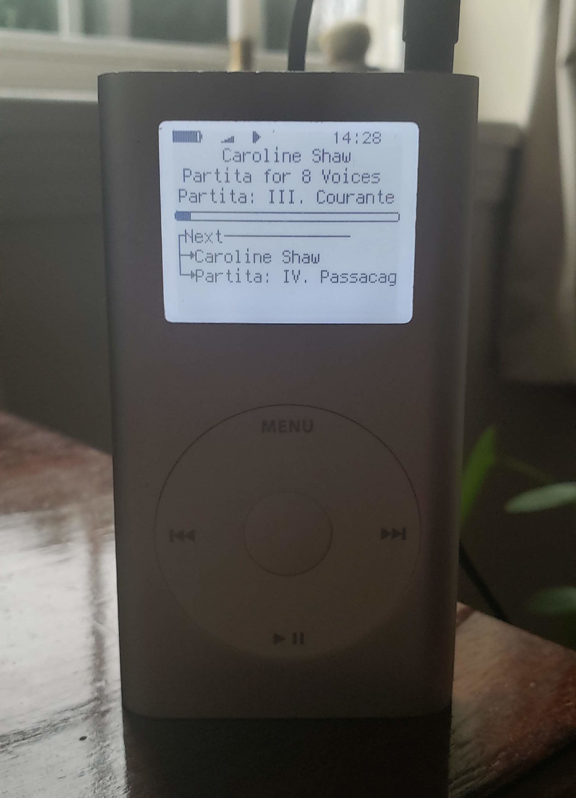

# Why?
A couple reasons:

- Move away from Spotify to locally stored music
    - Being able to "own" my music, broadly;
    - Freely tag (Spoitfy's classical music tagging, for example, is infamously bad)
    - Be assured music won't [suddenly disappear](http://web.archive.org/web/20210106231652/https://www.digitalmusicnews.com/2021/01/06/spotify-reportedly-pulls-indie-songs/),
    - Move away from proprietary, ad-based software,
    - Support artists more directly ([related](http://web.archive.org/web/20201204082426/https://www.eff.org/deeplinks/2020/05/plan-pay-artists-encourage-competition-and-promote-free-expression))
- Cheap, replaceable hardware -- can get in great working condition for <$40 on eBay, less with patience, and much less for replacement parts
- Flashable with the FOSS [Rockbox](https://www.rockbox.org/)
    - Moving music is as easy as moving files to a flash drive, no dumb iTunes proprietary database format
    - Adds support for almost any music file format, versus the fairly limited stock Apple Firmware

# How?
## Hardware
Disassembly is listed as ["Moderate" difficulty by iFixit](http://web.archive.org/web/20210118102123/https://www.ifixit.com/Guide/iPod+Mini+Battery+Replacement/411) -- the only real risk is bending the aluminum shell or scratching the plastic.

- Replace battery, iFixit sells replacements for cheap
- Replace Apple hard drive with Compact Flash - SD Card Adapter
    - Cheap Amazon ones are incredibly bad, mine was already falling apart from inserting the SD card a few times and eventually didn't even read.
        I'd recommend getting [a slightly higher quality](https://www.iflash.xyz/store/sdcf-adapter/) adapter.
- World's your oyster with memory!

<center></center>
<center>***iPod With Giant SD Card***</center>

Beware that fake SD cards lead to fairly transparent issues!
The 512GB SD card that Rockbox recognizes in that picture turned out to be very fake, and in fact only had 32GB of storage space.
This manifests as filesystem corruption when writing music past the *actual* memory limit.
I've replaced with a 64GB genuine SD card that has more than enough room for me.

> *The limit on SD card size is hypothetically 2TB, an inherent limit of the FAT32 filesystem used.*

## Software
Flashing Rockbox is dead easy.
Grab *Rockbox Utility* from the [download page](https://www.rockbox.org/download/), just plug in the iPod and the Rockbox GUI installer takes care of everything.
Reboot the iPod and *voilà*, Rockbox will flash itself and you're good to go.

<center></center>

Upload music just like you'd move music to a flash drive.
Done!

# Building Rockbox From Source, Installing Manually
Being open source, any issues or tweaks with Rockbox can be investigated and patched in the source code.
Building from source and flashing manually is also a great way to get more granular control over the final installation.

## Building Source
```
$ git clone git://git.rockbox.org/rockbox.git
```
Getting the tooling setup is a huge pain, fortunately there's a Docker image included,
```
$ cd rockbox/tools/docker_rbclient/
$ docker build -t rockbox .
```
The *README* in that directory has a great overview of how to use the Docker image.
To actually compile for the iPod Mini (2nd generation, in this case), the specific flags,
```shell
# out-of-source building
$ mkdir build_ipod && cd build_ipod
# ARM-based iPod
$ ../tools/rockboxdev.sh --target="a"
# to build Normal...
$ ../tools/configure --target=ipodmini2g --type=N
$ make
# to build Bootloader...
$ ../tools/configure --target=ipodmini2g --type=B
$ make
```
Easy enough!

## Setting up Partitions
To actually move the compiled bootloader and firmware to the iPod, need to setup partitions!
Fortunately, Rockbox is cool with one giant partition.
```
# assume the iPod is plugged in as /dev/sdb
# (please check before writing over anything)
$ fdisk /dev/sdb
# ...follow the prompts to make one whole-disk W95 FAT32 partition
# and add filesystem to that one partition
$ mkfs.fat -F32 /dev/sdb
```
Lastly, copy over the compiled Rockbox build,
```
$ mount /dev/sdb /mnt
$ cp -r .rockbox /mnt/
```
That's it!
Reboot the iPod and Rockbox will begin flashing.
You can add music to a new *Music/* directory, or just throw anything in the base directory.
