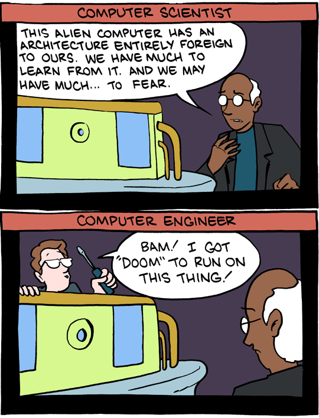
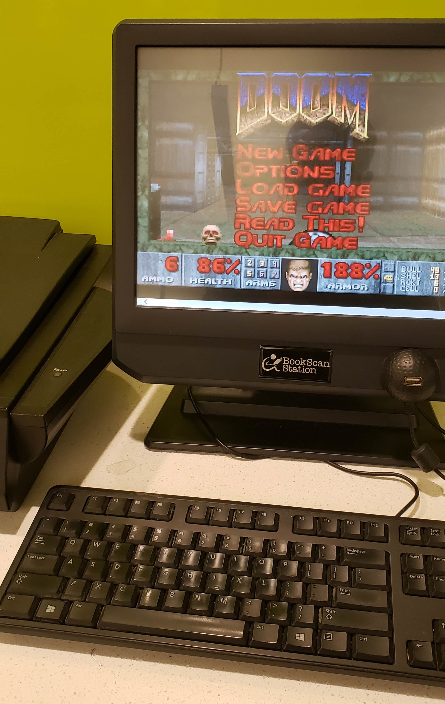

# Background

Since its original release in 1993, the original *DOOM* has had a very strong community.
One part of that community is the meme and challenge *It Runs DOOM*.
In 1997, the source code of *DOOM* was released (and placed under a GPL license in 1999).
This source allowed the community to port the game to platforms not officially supported by the *id Software* developers.

This porting became so common that it's even a challenge to port *DOOM* to the most obscure and unexpected platforms.

***Source: <a href="https://www.smbc-comics.com/?id=2158">SMBC: 'The Difference'</a>***

Some of the craziest I've seen are [a pregnancy test](https://twitter.com/Foone/status/1302820468819288066), an [Altera CycloneV FPGA](https://twitter.com/sylefeb/status/1258808333265514497) (like... just the FPGA, doesn't have a CPU or instructions), and [very common processor, but with only move instructions](https://github.com/xoreaxeaxeax/movfuscator/tree/master/validation/doom).

# *DOOM* on Northeastern University's Print Stations

This port isn't *nearly* as complex as those I listed above.
Using the public print stations, I really don't want to break something, or make the underpaid underappreciated helpdesk students do more work than they have to.
I want to run *DOOM*, then close it and leave everything as I found it.

One time when using the print station, my friend Connor was greeted with this:

Well, some part of the printing GUI seems to have failed, doesn't seem to be loading any of the graphics but the buttons work fine.

What a suspicious looking "Hidden" button!
What does it do?
Well, according to Connor, it brings up some admin panel looking thing asking for a PIN.
Seems a little too security sensitive for me, but it does give the impression that there's some way to get out of this printing software box.

## Investigating

This GUI is probably some proprietary application that runs right after boot on top of an operating system.
Well, there's an easy way to maybe get some info: restart the computer!
And yep, there's a Windows 7 boot screen that immediately leads into the splash screen for this printing software.

So, the goal here is to get out of this software and get access to the whole OS.

After some initial fiddling, I stumbled across an extremely easy way to bypass this software.
When scanning something, just... unplug the scanner.
The OS gets very angry and pops up an error message, but more importantly, the full taskbar.

***hello***

Can even see the print station software there in the taskbar to get everything set up again.

What's that "mds" background?
One search away, [MDS Secure Cloud Printing Made Easy](https://www.marketingdatasolutions.com/sentry-print-services).
Northeastern must have contracted this setup from them.
And hey, it seems Colorado School of Mines uses this too.
Any student from there is free to use this strategy as well.

## Setting up *DOOM*

Again, I want to leave no trace here.
There's probably some nice way to do this, like bring in a statically linked DOOM executable on a flash drive and see if it can be executed from there; or copied over and deleted afterwards.
I went with the dumb solution of "hey look a browser".

***Thanks <a href="https://www.dosgames.com/">dosgames.com</a>***

Full screen, and a nice integrated *DOOM* experience.

***Print and Tear!***

Clear the browsing history, close the browser, and for good measure restart the whole computer.
Yep, dumped into the printing software again, no damage done!
