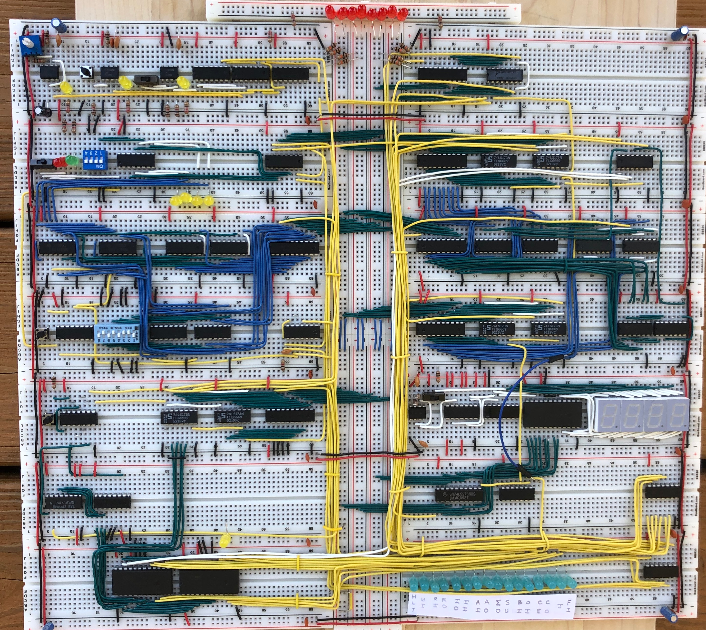
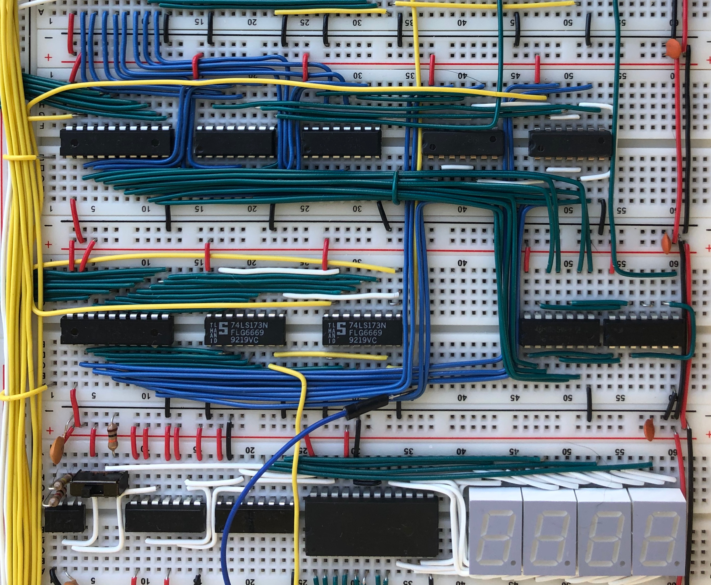

## Build Process
During *the current situation* (see date), I built Ben Eater's 8-bit
breadboard CPU.

<center></center>

The simple architecture provides for a modular and testable build, however with a deeply
complex final result.

I found the wiring very pleasant, and really enjoyed making the wiring very tidy:

<center></center>

## Architecture
The CPU consists of a few discrete modules:
- Clock (variable frequency)
- A register
- B register
- Instruction Register
- ALU
- RAM (memory, address register)
- Program Counter
- Output register and display
- Control logic (microcode decoding, microinstruction counter)

### Instruction Set
The CPU uses 8-bit instruction words,

<center>
Instruction  Machine Code  Meaning
-----------  ------------- -------
`NOP`         `0000_xxxx`    Do nothing
`LDA imm8`    `0001_imm8`    `A = ram[imm8]`
`ADD imm8`    `0010_imm8`    `A += ram[imm8]`
`SUB imm8`    `0011_imm8`    `A -= ram[imm8]`
`STA imm8`    `0100_imm8`    `ram[imm8] = A`
`LDI imm8`    `0101_imm8`    `A = imm8`
`JMP imm8`    `0110_imm8`    `PC = imm8`
`JC imm8`     `0111_imm8`    if carry flag `PC = imm8`, else `PC++`
`JZ imm8`     `1000_imm8`    if zero flag `PC = imm8`, else `PC++`
`OUT`         `1110_xxxx`    `OUT = A`
`HLT`          `1111_xxxx`   Halt CPU
-----------  ------------- -------
</center>

### Memory
The memory is addressed by the lower nibble of instructions and immediates (so 4 bits), leading to a maximum of 16 bytes of addressable RAM.

## Emulator, Example Program
Immediately following the build, I wanted to implement the CPU in a HDL.
I settled on Verilog, after using it in a Digial Logic class (but not understanding it much).
[eateremu](https://github.com/jleightcap/eateremu) provides a simple interface to modify and test this architecture and programs.

Writing a simple program in ram.v,
```verilog
// ...
initial begin
    memory[0]  <= 8'b0101_1111; // LDI 15
    memory[1]  <= 8'b0100_1111; // STA 15
    memory[2]  <= 8'b0010_1111; // ADD 15
    memory[3]  <= 8'b0100_0100; // STA 4
    memory[4]  <= 8'b0000_0000;
    memory[5]  <= 8'b1110_0000; // OUT
    memory[6]  <= 8'b0110_1110; // JMP 14
    memory[7]  <= 8'b0000_0000;
    memory[8]  <= 8'b0000_0000;
    memory[9]  <= 8'b0000_0000;
    memory[10] <= 8'b0000_0000;
    memory[11] <= 8'b0000_0000;
    memory[12] <= 8'b0000_0000;
    memory[13] <= 8'b0000_0000;
    memory[14] <= 8'b1111_1111;
    memory[15] <= 8'b0000_0000;
end
// ...
```
This program uses the ALU to calculate the data `0x1e`, then executes that data as the instruction `LDA 14`.
The contents of memory address 14 are stored to the output register then executed as the instruction `HLT`.

Compiling `eateremu.v` with `-DVERBOSE` shows the status of the control word and registers as the program executes.
The order of bits in the control word are `hlt, mi, ri, ro, io, ii, ai, ao, eo, su, bi, oi, ce, co, j, fi`.
Executing the above program,

```bash
       0: bus=zzzzzzzz ctrl=0000000000000000 mem_addr=0 a=00 b=00 o=00
0
       1: bus=zzzz0000 ctrl=0100000000000100 mem_addr=0 a=00 b=00 o=00
       3: bus=01011111 ctrl=0001010000001000 mem_addr=0 a=00 b=00 o=00
       5: bus=zzzz1111 ctrl=0000101000000000 mem_addr=0 a=00 b=00 o=00
       6: bus=zzzz1111 ctrl=0000101000000000 mem_addr=0 a=0f b=00 o=00
       7: bus=zzzzzzzz ctrl=0000000000000000 mem_addr=0 a=0f b=00 o=00
1
      17: bus=zzzz0001 ctrl=0100000000000100 mem_addr=0 a=0f b=00 o=00
      18: bus=zzzz0001 ctrl=0100000000000100 mem_addr=1 a=0f b=00 o=00
      19: bus=01001111 ctrl=0001010000001000 mem_addr=1 a=0f b=00 o=00
      21: bus=zzzz1111 ctrl=0100100000000000 mem_addr=1 a=0f b=00 o=00
      22: bus=zzzz1111 ctrl=0100100000000000 mem_addr=f a=0f b=00 o=00
      23: bus=00001111 ctrl=0010000100000000 mem_addr=f a=0f b=00 o=00
      25: bus=zzzzzzzz ctrl=0000000000000000 mem_addr=f a=0f b=00 o=00
2
      33: bus=zzzz0010 ctrl=0100000000000100 mem_addr=f a=0f b=00 o=00
      34: bus=zzzz0010 ctrl=0100000000000100 mem_addr=2 a=0f b=00 o=00
      35: bus=00101111 ctrl=0001010000001000 mem_addr=2 a=0f b=00 o=00
      37: bus=zzzz1111 ctrl=0100100000000000 mem_addr=2 a=0f b=00 o=00
      38: bus=zzzz1111 ctrl=0100100000000000 mem_addr=f a=0f b=00 o=00
      39: bus=00001111 ctrl=0001000000100000 mem_addr=f a=0f b=00 o=00
      40: bus=00001111 ctrl=0001000000100000 mem_addr=f a=0f b=0f o=00
      41: bus=00011110 ctrl=0000001010000001 mem_addr=f a=0f b=0f o=00
      42: bus=00101101 ctrl=0000001010000001 mem_addr=f a=1e b=0f o=00
      43: bus=zzzzzzzz ctrl=0000000000000000 mem_addr=f a=1e b=0f o=00
3
      49: bus=zzzz0011 ctrl=0100000000000100 mem_addr=f a=1e b=0f o=00
      50: bus=zzzz0011 ctrl=0100000000000100 mem_addr=3 a=1e b=0f o=00
      51: bus=01000100 ctrl=0001010000001000 mem_addr=3 a=1e b=0f o=00
      53: bus=zzzz0100 ctrl=0100100000000000 mem_addr=3 a=1e b=0f o=00
      54: bus=zzzz0100 ctrl=0100100000000000 mem_addr=4 a=1e b=0f o=00
      55: bus=00011110 ctrl=0010000100000000 mem_addr=4 a=1e b=0f o=00
      57: bus=zzzzzzzz ctrl=0000000000000000 mem_addr=4 a=1e b=0f o=00
4
      65: bus=zzzz0100 ctrl=0100000000000100 mem_addr=4 a=1e b=0f o=00
      67: bus=00011110 ctrl=0001010000001000 mem_addr=4 a=1e b=0f o=00
      69: bus=zzzz1110 ctrl=0100100000000000 mem_addr=4 a=1e b=0f o=00
      70: bus=zzzz1110 ctrl=0100100000000000 mem_addr=e a=1e b=0f o=00
      71: bus=11111111 ctrl=0001001000000000 mem_addr=e a=1e b=0f o=00
      72: bus=11111111 ctrl=0001001000000000 mem_addr=e a=ff b=0f o=00
      73: bus=zzzzzzzz ctrl=0000000000000000 mem_addr=e a=ff b=0f o=00
5
      81: bus=zzzz0101 ctrl=0100000000000100 mem_addr=e a=ff b=0f o=00
      82: bus=zzzz0101 ctrl=0100000000000100 mem_addr=5 a=ff b=0f o=00
      83: bus=11100000 ctrl=0001010000001000 mem_addr=5 a=ff b=0f o=00
      85: bus=11111111 ctrl=0000000100010000 mem_addr=5 a=ff b=0f o=00
      86: bus=11111111 ctrl=0000000100010000 mem_addr=5 a=ff b=0f o=ff
      87: bus=zzzzzzzz ctrl=0000000000000000 mem_addr=5 a=ff b=0f o=ff
6
      97: bus=zzzz0110 ctrl=0100000000000100 mem_addr=5 a=ff b=0f o=ff
      98: bus=zzzz0110 ctrl=0100000000000100 mem_addr=6 a=ff b=0f o=ff
      99: bus=01101110 ctrl=0001010000001000 mem_addr=6 a=ff b=0f o=ff
     101: bus=zzzz1110 ctrl=0000100000000010 mem_addr=6 a=ff b=0f o=ff
     103: bus=zzzzzzzz ctrl=0000000000000000 mem_addr=6 a=ff b=0f o=ff
7
     113: bus=zzzz1110 ctrl=0100000000000100 mem_addr=6 a=ff b=0f o=ff
     114: bus=zzzz1110 ctrl=0100000000000100 mem_addr=e a=ff b=0f o=ff
     115: bus=11111111 ctrl=0001010000001000 mem_addr=e a=ff b=0f o=ff
     117: bus=zzzzzzzz ctrl=1000000000000000 mem_addr=e a=ff b=0f o=ff
```

This is a great example of the benefits of writing 'closer to the metal': it's a really mind-melting
experience to execute data as instructions, and store instructions as data.
That level of control is obfuscated (with the major trade-off of convenience) behind assemblers
and compilers.
