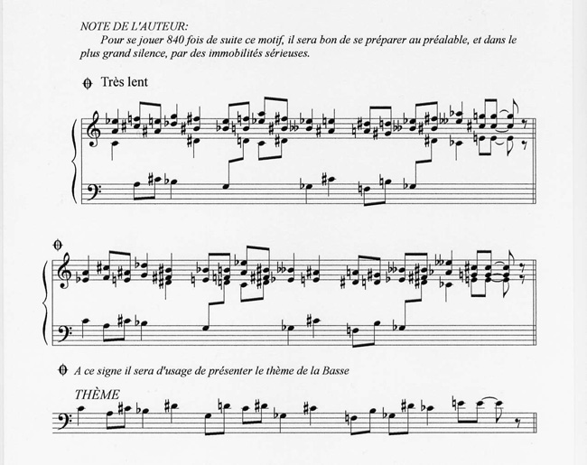

# Erik Satie - Vexations (1894)

<a href="../index.html">Jack Leightcap</a>

date: March 10, 2019

## First recording, 6 hours (2017)
During my Junior year of high school, I recorded a 6-hour performance of [Erik Satie's <i>Vexations</i>.](https://www.youtube.com/embed/zuszCTwh11k)
This was extremely underplanned, and a surprising amount went wrong.
I used Windows 10's default camera app with a random webcam, and found - during the recording - Windows Camera had a 2 hour recording limit.
Because I was recording audio separately, the audio and video were desynced, so the required merging of the video and audio required some guesswork in matching my fingers to the audio.
Not even worrying about the scaling of unnecessary rendering time, if anyone cared enough to skim through for these cuts, they'd find a couple dropped frames.
If anyone wanted to take a record seriously these cuts would be extremely suspicious.

Besides the technical aspects, I definitely knew I could've played longer than 6 hours.
These were hard limits that are naturally imposed by living with family and having to be 'healthy'.
I kept the idea of beating my personal record in the back of my head throughout high school and into college.

## Second recording, livestream 34 hours (2019)
Two years later, over the Spring Break of my Freshman year, the chances of anyone interrupting me in my dorm were extremely low. With some more planning, I decided it was time to beat my record.
[I livestreamed my performance for 34 hours](https://www.youtube.com/embed/vK_SZF6x4UA).
As far as I can tell, this is the world record (albeit unverified) for a recorded solo piano marathon performance. Nicolas Horvath, a huge inspiration, has done a 35 hour live performance, although unrecorded.

While this recording avoided most of the issues with using terrible default Windows apps, there were still unseen challenges and unfortunate rendering.
YouTube does archive streams, but only up to a handful of hours.
For practicality this makes sense, so I knew at least to store a local recording as well.
In place of the cuts in my earlier performance, the rendering here was just combining some split video files with ffmpeg.

Will I do another performance in the future?
Maybe, but not soon.
It was an extremely unique situation to be able to dedicate 34 hours where I was also unlikely to be interrupted.
I'd definitely like to beat Nicolas Horvath's record, recorded or not, but the entire performance was extremely draining.
I didn't eat or drink for a 24 hour period before I started, and I was hallucinating and close to passing out when I was forced to stop an hour before the record.

## Brief Explanation of <i>Vexations</i>
<i>Vexations</i> was written by Erik Satie, a milestone composer in what would become the Avant-Garde.
There are plenty of stories about how eccentric Satie was, eating only white food and his apartment having two grand pianos stacked on top of one another are two examples out of many.
<i>Vexations</i> gives a speed of "Très lent" (very slow), with the caption "Pour se jouer 840 fois de suite ce motif, il sera bon de se préparer au préalable, et dans le plus grand silence, par des immobilités sérieuses" (In order to play the theme 840 times in succession, it would be advisable to prepare oneself beforehand, and in the deepest silence, by serious immobilities).
The sheet music gives two variations and a theme to be repeated,

While repeating the same thing an extremely specific number of times is definitely a joke in line with Satie's humor, it's been more fun to interpret it literally.
The first performance included John Cage, the major figure associated with the Avant-Garde, and since then there's been a small community that pushes the performance time.
Currently, there are a decent handful of 24 hours performances, and I'm currently in second behind Nicolas Hovarth.
