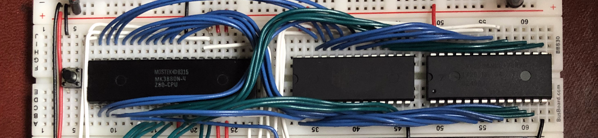
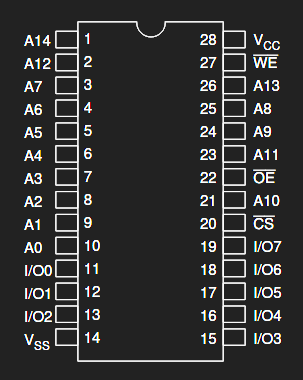
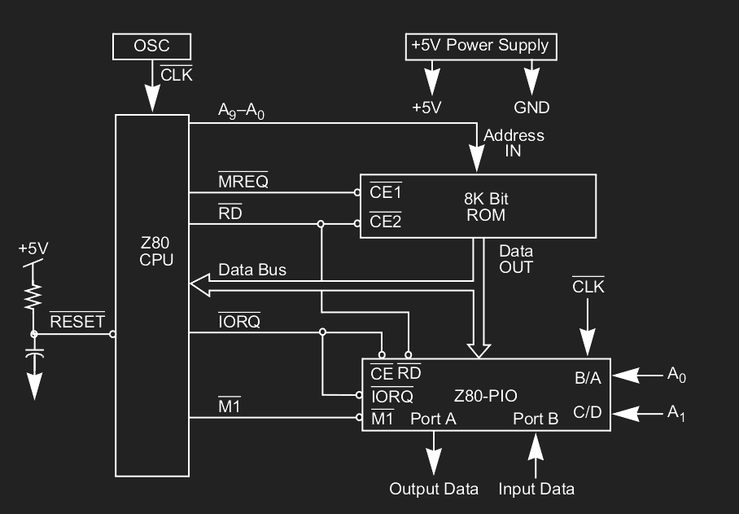

# Abstract

<center><center></center></center>

In this post, I'll go through the steps in designing a homebrew computer from CPU up to "Hello, world!"

Previously I built an 8-bit [breadboard CPU](../eatercpu/eatercpu.html) designed by Ben Eater.
Ben Eater's designs and fantastic teaching have ushered in a kind of renaissance for DIY breadboard projects that explore computer engineering topics.
His projects explore each level of abstraction: from how a transistor works, to logic gates, to memory, to a CPU and computer architecture, up all the way to 'high level' (comparatively speaking) C programs.

After building his breadboard CPU, I felt I had learned a lot -- but there was a voice nagging in the back of my head saying "this isn't *mine*, I didn't *make* this!"
While the design has very logical parts that fit together in expected ways, is this something I could've designed on my own: finding parts, making schematics, realizing my design mistakes?

Similar to his breadboard CPU design, [he has a project using the MOS 6502](https://eater.net/6502) as the center of a homebrew computer focusing more on assembly programming, memory hierarchy, and hardware interfacing.
I wanted to follow in going up the layers of abstraction, but with a design (flaws and all) I can truly call my own.

In my case, I'm largely deviating from Ben's build by using the *Zilog Z80* and its associated family of peripherals.
I won't get into comparing the relative strengths of the 6502 and Z80, but suffice it to say the Z80 has some nicer features that show up both in hardware and software design.

# Z80 Background

The [Zilog Z80](https://en.wikipedia.org/wiki/Zilog_Z80) is an 8-bit microprocessor from the 1970s, contemporary to the 6502.
There's a good chance you've interacted with a Z80 at some point:

- a lot of people will have used the super common TI-83 or TI-84 calculator all throughout high school or college
- Nintendo Gameboy's core Z80 (modification/derivative), original *Pac-Man* arcade cabinet, SEGA consoles
- music synthesizers
- still in production! Used in many embedded systems

So you could say learning about this ancient (by computing standards) 1970s microprocessor architecture is practical (maybe).

# Basic Z80 Functionality: `NOP` Loop

On its own the Z80 isn't terribly exciting.

<center><center></center></center>
<center>***40-pin DIP Z80 Pinout*** (copyright Zilog)</center>

To get familiar with how the Z80 executes instructions, I'll run the simplest possible program.
To do anything, connect all the inputs to *something*, even if temporary:

- hook up power and ground appropriately
- connect the clock to some kind of pulse generator, a push button even
- connect `\INT`, `\NMI`, `\BUSRQ` and `\WAIT` to 5V (note: the backslash before a pin is a convention indicating that pin is active low)
- optionally connect `\RESET` to a button that defaults to 5V and pulls low, if not then just keeping at 5V is fine
- wire the data bus `D0`-`D7` to ground through a ~1kΩ resistor
- hook up LEDs or any kind of monitor to the address bus `A0`-`A15`

> *What will this do?*

With some kind of monitor, the address lines are just counting up in binary.
The Z80 is being fed the instruction `0x00` -- if you look at an [instruction set reference](https://clrhome.org/table/#), you'll see `0x00` is the instruction `NOP` (No OPeration).
What this is doing, in effect, is:

1. put out the address of the current instruction on the address bus
2. read the instruction that's on the data bus, here hard coded to `0x00` or `NOP` (eventually the value on the address bus is used to
   look up instructions in memory, but again... simplest possible)
2. execute that instruction, doing... well, nothing
4. increment the address bus to the next instruction
5. go to 1

A very dull program, but a program nonetheless!
Where the complexity comes in:

- instructions that are not `NOP` (try not to get too excited!)
- how to actually feed different instructions to the CPU

*You* could act as the memory here: stepping the clock, and manually setting the bits to the appropriate instruction!
It might be worth it to play around this way just to feel how painful programming this manually is.

But, the appropriate way to feed the Z80 instructions is through some kind of memory.

# Memory Hierarchy
## Memory Hierarchy: Adding ROM

ROM (Read Only Memory) is a reasonable next step to piping some instructions over to the Z80.
For this, I'll be using the 28C256 256K Parallel EEPROM.
Lots of adjectives to describe a pretty simple idea: the ROM lives up to its name as some memory that the Z80 can read (and only read) from.
The memory capacity of this chip is 256K bits, split into 8-bit words: in other words 32K 8-bit words.

I'll be using the TL866 universal programmer for writing programs to the ROM, it allows for raw binary files to be pretty easily uploaded to an EEPROM over USB.
There's an open-source, multi-platform controller for the TL866 called [minipro](https://gitlab.com/DavidGriffith/minipro) that makes programming much easier than by hand:

```bash
$ minipro -p AT28C256 -w FILE.bin
```

> *So, how is the 28C256 connected to the Z80?*

<center><center></center></center>
<center>***28-pin DIP 28C256 Pinout*** (copyright Atmel)</center>

First thing to look at is the 28C256 datasheet: besides the address and data bus there's only three signals that actually control anything, so all there is to do is figure out is how to connect:

- `\CE` (chip enable
- `\RD` (read)
- `\WR` (write)

> *Wait... didn't I just say the ROM was read only?*
> *Why is there a write pin?*

Yes, the ROM is read only, but only from the perspective of the Z80.
The `\WR` pin is used when writing programs to the ROM with the universal programmer.

This solves one connection: the Z80 should never write to ROM, so tying that pin high prevents it from being written when the ROM is connected to the whole system.
Now to use some of those output pins that haven't been touched yet: specifically `\RD` (read) and `\MREQ` (memory request).
Just connecting the reads of both chips together: the Z80 pulls the read pin low whenever it's reading, but the ROM should shut up otherwise.
That works.
But I only want the ROM to output instructions when the Z80 is talking to *it* (memory) specifically: `\MREQ` is pulled low whenever the Z80 wants to talk to memory, so connecting `\MREQ` to `\CE` means, in total: ROM only outputs its data when the Z80 is both *reading*; and *reading* from *memory*.

So now I can just fill the ROM with `0x00` and get the same behavior as before!

> *So now this is the fancy 'do nothing' machine, but with an extra chip?*

Well, there's plenty of programs that can now be written to ROM!
There's still pieces missing to use the full Z80 instruction set effectively, but it's true that this can't do anything now that it couldn't do before with manually plugging instructions.
However, this computer is now *programatic*: without intervention it can execute some predetermined set of instructions.

I'm not going to do a deep dive into the Z80 instruction set here, that would make this post waaaaay longer than it needs to be.
Instead:

- If you want some hands-on learning, this is a great time to play around with other instructions besides `NOP` and get a feel for what they do!
Try to load some data into a register then change that data somehow, then follow along what the CPU is doing for each instruction and how long it takes to execute those instructions.
- Just flipping through the Z80 datasheet also gives an idea of the kind of instructions it provides and what they could be used for.
- Otherwise, the programs in this post will be pretty simple and easy to understand just through context.

## Memory Hierarchy: Adding RAM

If you played around long enough just messing around with data in the Z80 registers, then you might have run into the issue that you quickly run out of places to put those shiny new calculated values.
There's only so many registers to use, and a lot of those registers are used for program control, not just data.
The ROM doesn't help since it can't be written to.
What's needed in this case is some RAM (Random Access Memory)... maybe a better word for RAM here is "Read/Write Memory".

I'll be using a RAM chip of the same size (both pin number and 32kB data storage): the 62256 256K SRAM.

> **side note**: what does SRAM mean?
> SRAM is *static* RAM: that is, you write something to it and all you need to do to keep it around is have it powered on.
> This is compared to DRAM (*dynamic* RAM), where you constantly have to refresh the memory to keep it around even when it's powered.
> Both have their benefits and drawbacks, and in fact the Z80 supports both; I won't be using DRAM, but DRAM is
> exactly what the Z80's `\RFSH` pin is for.

<center><center></center></center>
<center>***28-pin DIP 62256 Pinout*** (copyright Hitachi)</center>

So once again have the problem of how to get the Z80 to talk to a new chip, and it's a little harder this time.
Once again checking the datasheet, notice that the RAM has the exact same pinout as the ROM!
This makes connecting the data and address buses a lot easier.
But there's still those three control pins to connect: `\CE`, `\RD`, and `\WR`.

> *First, what if you connected the RAM similarly to the ROM?*
> *Maybe get lucky and that works?*

Never a bad idea to check the simplest case.
Some of the connections come easy just from lining up names: connecting the Z80's read and write appropriately to RAM means it takes in data or outputs data appropriately.
That connection is perfectly fine.
But what if `\MREQ` is connected to both the ROM and RAM's chip enable?
If data is *read* from RAM *memory* (both `\RD` and `\MREQ` are pulled low); both the ROM and RAM will be talking at the same time on the data bus, which is a recipe for a hard-to-debug disaster.

The solution is outside of the pins provided and needs more hardware.

## Memory Hierarchy: Memory Map and Address Decoding

> *But what hardware is needed to use both ROM and RAM?*
> *There's plenty of fancy "address decoding" chips available, maybe something along those lines?*

Well, those chips would probably work, but the RAM is (spoiler) the last memory device I'm going to be adding.
So the simplest possible solution for this case is perfectly fine, I'm not going to worry about expandability or anything fancier than needed.

Since the Z80 only has 16 address lines (`A0`-`A15`), it can uniquely index a limited amount of memory:
<center>
$$
2^{16} = 64\text{kB}
$$
</center>

> *Hey wait a minute, that's the total amount of ROM and RAM memory!*

Wow what a fortunate coincidence: the 32kB of memory from both ROM and RAM together completely 'max out' the memory the Z80 can directly index.
Almost seems planned.
Also, that's pretty close to the size of the Z80 pinout image towards the beginning of this post for context to modern data storage standards.
That's nice, but still have the problem of distinguishing which memory the Z80 is talking to.
Drawing a *memory map* of the way I want the Z80 to address memory:

<center>
```
0xffff +-----+
       |     |
       | RAM |
       | 32K |
       |     |
0x7fff +-----+
       |     |
       | ROM |
       | 32K |
       |     |
0x0000 +-----+
```
</center>

> *Why put ROM first under RAM?*

Putting the ROM below RAM doesn't seem strictly necessary, at least from how I understand the Z80.
However, I'm going to guess it saves a lot of headache to map memory this way: for example, when resetting the Z80, it starts at address `0x0000`.
Having ROM there, the same instructions are executed on reset every time.

But, the key is in the words *below* and *under*: they answer what distinguishes ROM from RAM.
At the boundary between, the thing that changes is the topmost bit of the address bus `A15`.
Address `0b011111111111111` is in ROM, while address `0b1000000000000000` and everything above is in RAM.
To decode which memory device is being talking to, there has to be some kind of combination of `\MREQ` and `A15`.

Drawing a truth table:

<center>
| `\MREQ` | `A15` | `\OE_ROM` | `\OE_RAM` |
|:-------:|:-----:|:---------:|:---------:|
|   `0`   |  `0`  |    `0`    |    `1`    |
|   `0`   |  `1`  |    `1`    |    `0`    |
|   `1`   |  `x`  |    `x`    |    `x`    |
</center>

When memory is request by pulling `\MREQ` low, depending on `A15`, pull low the appropriate chip enable and disable the other.
In the case where `\MREQ` is high, we don't care about the state.
The simplest expression from this truth table for both enables:

<center>
$$\neg OE_{RAM} = \neg MREQ \vee A_{15}$$
$$\neg OE_{ROM} = \neg (\neg MREQ \vee A_{15})$$
</center>

> *Wait is it true we don't care about the state where `\MREQ` is high then?*
> *`\OE_RAM` will be enabled in any case where `\MREQ` is high; will it output data on the bus when it shouldn't then?*

What a subtle issue to notice, author!
As it will turn out it doesn't matter, because the only time the Z80 addresses above `0x8000` it will be for accessing RAM.
Addressing data that isn't memory will come later, though; for now just suspend disbelief.

These two expressions involve one `OR` and one `NOR` -- both of the same expression.
This can be implemented on 2 `NOR` gates, with one inverting the output of the other.
Not much extra hardware to add fortunately!

With this, the computer has both ROM and RAM.
Now temporary values can be stored, and the complexity of programs that can be written greatly increases.

> *Has adding RAM actually increased the class of programs this computer can run?*

On a *Theory of Computation* level, I think so: the computer can now maintain some kind of state using writable memory;
and I'll use the formal "appeal to I mean yeah probably" to claim it's now Turing Complete.
Of course you could just simulate the RAM with paper and pencil or something, but at that rate I have to wonder if you're reading this on a clay tablet or something.

# Hardware Interfacing

## Hardware Interfacing: Z80 PIO

The Z80 PIO (Parallel Input Output) is a Z80-family peripheral that makes interfacing between the Z80 and external hardware much easier.

The Z80 datasheet includes a PIO setup:

<center><center></center></center>
<center>***Z80 PIO Schematic*** (copyright Zilog)</center>

Well that ROM connection isn't at all what I'm going for, but that PIO connection looks promising!
The `\RD` connection shouldn't be too surprising after going through the ROM and RAM configuration.
`\IORQ` is the real key to what makes Z80 interfacing so easy: there's a very deep distinction between input/output devices and system memory.
`\IORQ` is almost identical to `\MREQ`, but instead of requesting from memory the Z80 is requesting from IO devices.

With this split, the IO devices are *not memory mapped* -- writing to a piece of attached hardware is fundamentally different than writing to RAM.
The results are very clean, separated address spaces with no chance of bleed through.
However, nothing is limiting memory mapping hardware with the Z80 (with the appropriate address decoding).
Memory mapping has its own advantages, and may even be preferred for some devices!

The `\M1` connection is not particularly important for the sake of this post, just consider it a type of additional synchronization between both chips.

Connecting the PIO's `\IORQ` and `\CE` both to the Z80 `\IORQ` has the same rationale as for the initial setup of the ROM when there was no RAM: if the Z80 is talking to an IO device, it must be talking to the PIO!

Finally are the `B/A` and `C/D` pins: these select the A/B port, and the control/data register for each port.
These are addressed with the lowest two bits of the address bus, leading to a IO memory map like:

<center>
```
...  +-----------+
     | B Control |
0b11 +-----------+
     | A Control |
0b10 +-----------+
     | B Data    |
0b01 +-----------+
     | A Data    |
0b00 +-----------+
```
</center>

Remember that subtle issue with the RAM addressing?
Well, the answer comes here: IO devices are addressed using only the lower half of the address bus, locations `0x0000`
through `0x00ff`.
If something is being addressed above `0x8000`, the only thing up there is RAM.

Assuming there's one device connected to port A, writing the value `0x42` to it:

```asm
; 1: set A Control register to output mode value
    ld A, 0x0f ; see Z80 peripherals datasheet p209 for what each bit means
    out (2), A
; 2: 0x42 to A Data register
    ld A, 0x42
    out (0), A
```

Nice and short program once everything is set up!

## Hardware Interfacing: HD44780 LCD Controller

I can forgive you if you forgot the point of all this was "Hello, world!"
Well, to print text I need a screen!
The HD44780 Controller is used for a wide variety of LCD screens, but there's a super common 2-column LCD that comes with a good number of beginner Arduino kits that I somehow have 2 of.

Interfacing with the LCD controller is a task in and of itself, the data sheet if full of red herrings completely irrelevant to actually just writing letters to the screen.
First, there's two modes that the LCD controller accepts: 8-bit mode, where the full 8-bit instructions are sent in one go; or the 4-bit mode, where the instructions are sent in two 4-bit chunks.
IO pins don't grow on trees, I'm using 4-bit mode!
Once a zoomin' clock is added the speed difference is negligible.

So at least 4 bits are needed to transfer the half-words, but there's also some control data to consider:

- data can be read back from the LCD by changing the `RW` bit, but I'll consider the LCD write-only
- a rising edge on `E` latches data into registers, this is necessary
- select control or data register using `RS`, the same ideas as the PIO, this is necessary as well

There's a minimum of 6 bits needed to interface with the LCD then: might sound stingy to go to this length, but I will use those other 2 bits later!
The order of the bits in port, somewhat arbitrarily picked:

<center>
`{E, RS, x, x, D_3, D_2, D_1, D_0}`
</center>

To write data to the LCD then, `{D_3 .. D_0}` are latched into port A, the same data is latched into port A but with E high (rising edge to latch into LCD register), then the same data again with E low.
This might be a good place for memory mapped IO: have to go through 2 levels of latches to finally talk to the LCD registers!

### LCD Control Program

The exact data to send is a mess to explain, so diving into the datasheet is definitely required to fully understand what's going on here.
I'll just annotate the gist of it:

```asm
; initialize output mode for IO port A
    ld A, 0x0f
    out (2), A

; LCD function set: 4-bit mode
    ld A, %00000010 ; 0b0010 (instruction select)
    out (0), A
    ld A, %10000010 ; toggle E on
    out (0), A
    ld A, %00000010 ; toggle E off
    out (0), A

; LCD function set: 2 rows, 5x8 characters
    ld A, %00000010 ; 0b0010_10xx upper nibble (instruction select)
    out (0), A
    ld A, %10000010 ; toggle E on
    out (0), A
    ld A, %00000010 ; toggle E off
    out (0), A
    ld A, %00001000 ; lower nibble
    out (0), A
    ld A, %10001000 ; toggle E on
    out (0), A
    ld A, %00001000 ; toggle E off
    out (0), A

; LCD display control: turn on, blink, etc.
    ld A, %00000000 ; 0b0000_1111 upper nibble (insruction select)
    out (0), A
    ld A, %10000000 ; toggle E on
    out (0), A
    ld A, %00000000 ; toggle E off
    out (0), A
    ld A, %00001111 ; lower nibble
    out (0), A
    ld A, %10001111 ; toggle E on
    out (0), A
    ld A, %00001111 ; toggle E off
    out (0), A
```

With that mess, there's now a blinking cursor at the top left of the screen!

### LCD Data Program

Makes sense to send over a character or two, which is helpfully encoded in standard ASCII:

```asm
    ; LCD display an 'H'
    ld A, %01000100 ; 8b0100_1000 upper nibble (data select)
    out (0), A
    ld A, %11000100 ; toggle E on
    out (0), A
    ld A, %01000100 ; toggle E off
    out (0), A
    ld A, %01001000 ; lower nibble
    out (0), A
    ld A, %11001000 ; toggle E on
    out (0), A
    ld A, %01001000 ; toggle E off
    out (0), A

    ; LCD display an 'I'
    ld A, %01000100 ; 8b0110_1001 upper nibble (data select)
    out (0), A
    ld A, %11000100 ; toggle E on
    out (0), A
    ld A, %01000100 ; toggle E off
    out (0), A
    ld A, %01001001; lower nibble
    out (0), A
    ld A, %11001001 ; toggle E on
    out (0), A
    ld A, %01001001 ; toggle E off
    out (0), A
```

Not quite "Hello, world!" and not particularly easy to look at!

# Putting It All Together: Stack, Function Calls, and "Hello World!"

## The Stack

I mentioned earlier that a benefit of RAM was storing temporary values when you run out of registers.
This is certainly true, but I think the bigger benefit is the *stack*.
The stack isn't some other piece of hardware (thank goodness this post is already a novella), but instead something that lives inside the RAM purely in software, maybe with some help by the instruction set.

One of the Z80 registers, `SP` or Stack Pointer, points to a place in RAM where a program can handily dump some bytes, and then grab them later without worry.
This is compared to the temporary registers, say `A`, which change rapidly and would severely limit programs if the data stored there needed any kind of permanence.
The Z80 stack grows down; meaning as values are added to the stack it decreases `SP`, and as values are removed from the stack it increases `SP`;
for example from `SP` = `0xffff` and pushing two bytes onto the stack, then `SP` = `0xfffd`.
The instruction set provides `push` and `pop` (add and remove respectively) which handle all of the `SP` manipulations.

## Function Calls

 > *Is the stack more than just something nice to have?*

Well, in some ways!
If there wasn't instructions provided for stack operations, you could implement the stack yourself in software by just dedicating some memory somewhere as your stack pointer; there's certainly nothing 'magical' about the stack.
However, the stack is vital for something so important in programming, so vital it might even be taken for granted: *functions*.

> *Why? Isn't a function just moving somewhere else in your program then coming back?*

Yes, from the perspective of the function caller, that's all a function is: you want it to go do something else and come back.
The issue there is: how does the CPU know where to go back to?
If the program stores where it should return in the `A` register for example, what happens if that function accidentally overrides the value in `A`?
Chaos!
The answer comes from the stack combined with the Z80 instructions `call` and `ret`:

- `call` pushes where the CPU should return to onto the stack
- `ret` pops that place to return to, and then tells the CPU to continue the program there

Easy to state the idea, but so important!
There's tons of nuances that come with this, some questions to consider:

- what if the callee function (the one called) pushes more times than it pops, or the other way around?
- what about function arguments? How should they move around with program execution?
- maybe messing with the stack in other ways could provide some handy optimizations?

## "Hello, world!"

With the knowledge of function calls, finally a "Hello, world!" program!

I'll use two functions: one to send a whole byte to the LCD:

```asm
; send byte in register A to LCD
LCD_PORT: equ 0
LCD_LATCH_BIT: equ 7
_LCD_send_byte:
    out (LCD_PORT), A
    set LCD_LATCH_BIT, A
    out (LCD_PORT), A
    res LCD_LATCH_BIT, A
    out (LCD_PORT), A
    ret
```

and another to send an ASCII character to the LCD:

```asm
; send char in register A to LCD
LCD_DATA_BIT: equ 6
_LCD_send_char:
    ; A stores lower nibble, B stores upper nibble
    ld B, A
    and A, 0x0f ; clear upper half of A
    srl B ; shift over upper nibble
    srl B
    srl B
    srl B
    set LCD_DATA_BIT, A ; select LCD data register
    set LCD_DATA_BIT, B
    ; send upper nibble
    ld C, LCD_PORT ; IO port immediates only supported for A register
    out (C), B
    set LCD_LATCH_BIT, B
    out (C), B
    res LCD_LATCH_BIT, B
    out (C), B
    ; send lower nibble
    out (LCD_PORT), A
    set LCD_LATCH_BIT, A
    out (LCD_PORT), A
    res LCD_LATCH_BIT, A
    out (LCD_PORT), A
    ret
```

And the rest is easy!
Writing the print loop explicitly character by character:

```asm
org 0x0000
start:
    ; initialize output mode for IO port A
    ld A, 0x0f
    out (2), A

    ; LCD function set: 4-bit mode
    ld A, %00000010
    call _LCD_send_byte

    ; LCD function set: 2 rows, 5x8 characters
    ld A, %00000010 ; 8b0010_10xx upper nibble (instruction select)
    call _LCD_send_byte
    ld A, %00001000 ; lower nibble
    call _LCD_send_byte

    ; LCD display control: turn on, blink, etc.
    ld A, %00000000 ; 8b0000_1111 upper nibble (insruction select)
    call _LCD_send_byte
    ld A, %00001111 ; lower nibble
    call _LCD_send_byte

    ; print "Hello, world!"
    ld A, 'H'
    call _LCD_send_char
    ld A, 'e'
    call _LCD_send_char
    ld A, 'l'
    call _LCD_send_char
    ld A, 'l'
    call _LCD_send_char
    ld A, 'o'
    call _LCD_send_char
    ld A, ','
    call _LCD_send_char
    ld A, ' '
    call _LCD_send_char
    ld A, 'w'
    call _LCD_send_char
    ld A, 'o'
    call _LCD_send_char
    ld A, 'r'
    call _LCD_send_char
    ld A, 'l'
    call _LCD_send_char
    ld A, 'd'
    call _LCD_send_char
    ld A, '!'
    call _LCD_send_char

    halt
```

*Finally*,

<center><center></center></center>
<center>***Say hello back!***</center>

Up Next: notice the buzzer! *beep beep*
