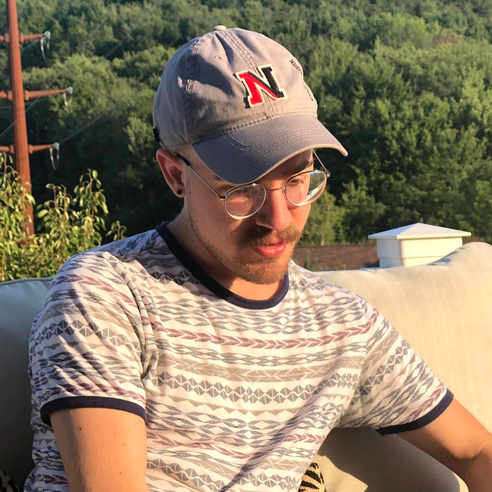

# About

I'm Jack, a Computer Engineering student at Northeastern University.

<a href="resume.c">Resume</a>
|
<a href="https://www.linkedin.com/in/jleightcap">LinkedIn</a>
|
<a href="https://github.com/jleightcap">GitHub</a>
|
<a href="mailto:jleightcap@protonmail.com">Email</a>
|
<a href="pubkey.txt">PGP</a>

# Projects
- [Discrete Signal Plotter](Project/discreteplotter/plot.html)
- [Z80 Homebrew Computer Part 1 -- Memory, LCD](Project/z801/z801.html)
- [Breadboard CPU](Project/eatercpu/eatercpu.html)
- [*PicrossSAT*: algorithm to convert Picross puzzle to SAT problem](Project/picrosssat/picrosssat.html)
- [*jleightcap* and *ScrollingScore*, classical music on YouTube](Project/jleightcap/jleightcap.html)
- [Playing piano for 34 hours straight: Erik Satie's *Vexations*](Project/vexations/vexations.html)
- [Charlie "The Travelling Salesman" on the MBTA](Project/mbtaspeedrun/mbtaspeedrun.html)

# Blog
- [iPod Mini in 2021 with Rockbox](Blog/ipodmini2g/ipodmini2g.html)
- [Print Station *DOOM*](Blog/printdoom/printdoom.html)
- [Study abroad at Cambridge University](Blog/cambridge/cambridge.html)

<footer>
 This work is licensed under
a <a rel="license" href="http://creativecommons.org/licenses/by-nc/4.0/">Creative Commons Attribution-NonCommercial 4.0
International License</a>.
</footer>
